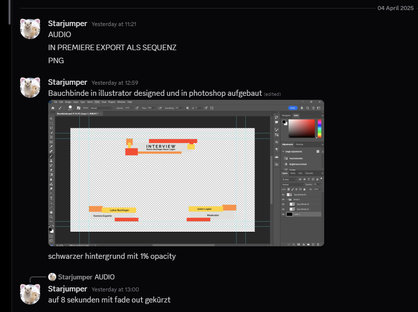
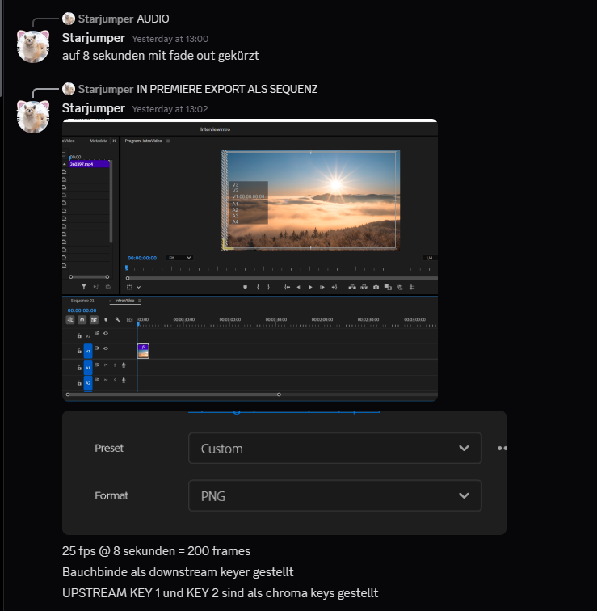

KAMERAS : f 5.6 1/50 0 gain 5600k

GRUND EINSTELLUNGEN

MISCHER 4k50

BAUCHBINDE

DOWNSTREAM KEY 1

mit DSK1 key togglebar

UPSTREAM KEY 1

Chroma key Camera 1

UPSTREAM KEY 2

Chroma Key Camera 2

Upstream key 3

DVE Picture in Picture einstellung Kamera 1

Upstream key 4

DVE picture in picture einstellung Kamera 2

beide pips mit border rot

MACROS

Macro 1

spielt Clip mit audio von Media player 1

aktiviert keying

aktiviert bauchbinde 

Macro 2

wechselt kameras auf moderator

deaktiviert key und bauchbinde

Macro 3

aktviert key 3 + 4 und setzt ein hintergrund 

PIP einstellung beide kameras

Macro 4

PIP einstellung deaktivieren

DVI Tools 

auf video pc 

screen capture --> black magic design

auf audio pc 

Studio monitor --> quelle von videopc 

