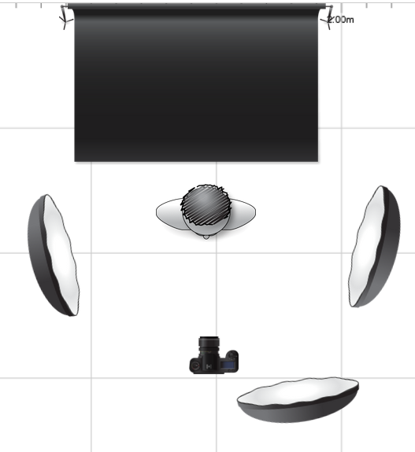

# Business Portrait
## Plan

### Bild Komposition

Subjekt: Julian Lagler

- In der Mitte des Bilds, etwas seitlich gedreht, business kleidung
- Green-Screen Hintergrund

### Kamera Einstellungen

- stativ verwenden
- keine stürzenden linien
- Augen soll scharf sein 
- 80mm KB aqivalente Brennweite
- kalibierien
- niedrige ISO verwenden
- Blende um wenig vezeichnung / Perspektivensturz auswählen

### Belichtungsdiagram

