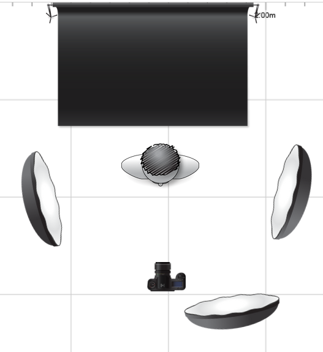

# Charakter Portraitr
## Plan

### Bild Komposition

Subjekt: Lukas Buchinger

- In der Mitte des Bilds
- Schwarzer Hintergrund
- Charakteristische Haltung mit Uhr sichtbar

### Kamera Einstellungen

- stativ verwenden
- keine stürzenden linien
- Augen soll scharf sein 
- kalibierien
- niedrige ISO verwenden
- Blende um wenig vezeichnung / Perspektivensturz auswählen

### Belichtungsdiagram

