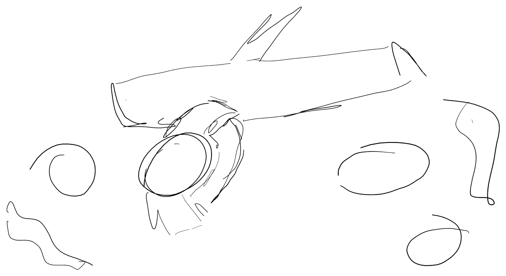
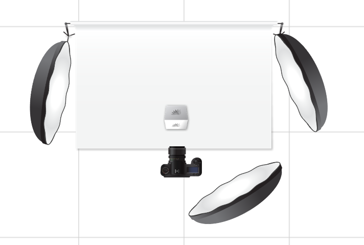

# Inszenierte Aufnahme einer Uhr
## Plan

### Bild Komposition

- Uhr etwas seitlich gestellt
- Steine, Blätter
- Ast im Hintergrund

### Kamera Einstellungen

- stativ verwenden
- keine stürzenden linien
- uhr soll scharf sein 
- kalibierien
- niedrige ISO verwenden
- Blende um wenig vezeichnung / Perspektivensturz auswählen

### Belichtungsdiagram

